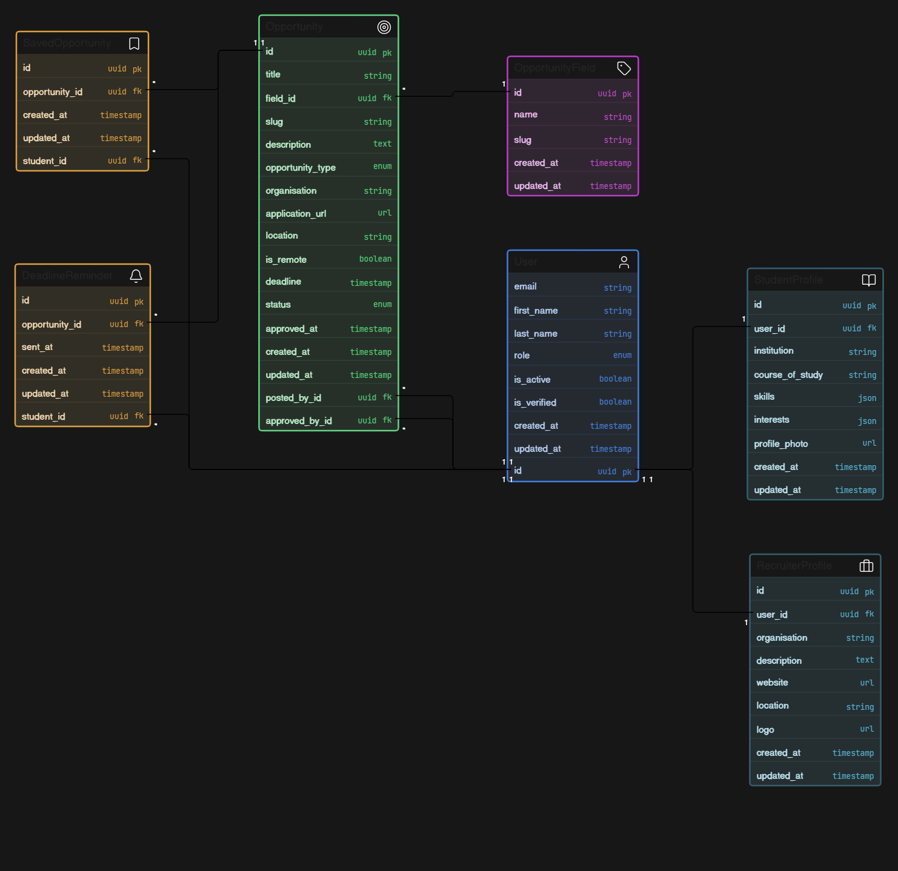

# OpportunityHub NG Backend API

OpportunityHub NG is an API-first backend for discovering and managing verified **internships, scholarships, and jobs** for university students and recent graduates.

The backend is built with Django and Django REST Framework (DRF), with a modular structure that separates database models, serializers, selectors, services, and API views.

---

## Table of Contents

- [Overview](#overview)
- [MVP Features](#mvp-features)
- [Technology Stack](#technology-stack)
- [Architecture](#architecture)
- [Project Structure](#project-structure)
- [Data Model](#data-model)
- [API Base URL](#api-base-url)
- [Interactive API Documentation](#interactive-api-documentation)
- [Authentication](#authentication)
- [API Overview](#api-overview)
- [Opportunity Discovery](#opportunity-discovery)
- [Opportunity Filtering and Search](#opportunity-filtering-and-search)
- [Saved Opportunities](#saved-opportunities)
- [Opportunity Management](#opportunity-management)
- [Opportunity Approval Workflow](#opportunity-approval-workflow)
- [Recruiter Profiles](#recruiter-profiles)
- [Deadline Reminders](#deadline-reminders)
- [Pagination](#pagination)
- [Local Development](#local-development)
- [Environment Variables](#environment-variables)
- [Database and Migrations](#database-and-migrations)
- [Seed Data](#seed-data)
- [Testing](#testing)
- [Background Tasks](#background-tasks)
- [Deployment](#deployment)
- [API Design Principles](#api-design-principles)
- [Future Improvements](#future-improvements)
- [License](#license)

---

## Overview

OpportunityHub NG addresses a common problem faced by students and recent graduates: relevant opportunities are often scattered across WhatsApp groups, social media, university communities, and different job or scholarship websites.

The platform provides a centralized API where users can discover opportunities such as:

- Internships
- Scholarships
- Jobs

Each opportunity can include:

- Title
- Description
- Opportunity type
- Organisation
- Organisation logo
- Application URL
- Location
- Opportunity field
- Application deadline
- Remote availability
- Approval status
- Publication timestamp

The API is designed so that a frontend application can consume the backend independently.

---

## MVP Features

The current MVP backend includes:

- User authentication
- Student and recruiter roles
- Recruiter profiles
- Opportunity fields
- Opportunity types
- Opportunity publishing workflow
- Admin approval status
- Public opportunity discovery
- Opportunity search
- Opportunity filtering
- Opportunity detail pages
- Saved/bookmarked opportunities
- Private opportunity management for authenticated users
- Deadline reminder infrastructure
- API schema and Swagger UI
- Automated backend tests
- Seed data for development

---

## Technology Stack

| Technology | Purpose |
|---|---|
| Python | Backend programming language |
| Django | Web framework |
| Django REST Framework | REST API |
| PostgreSQL | Production database |
| SQLite | Optional local development database |
| Redis | Celery broker/result backend |
| Celery | Background task processing |
| Resend | Transactional email delivery |
| drf-spectacular | OpenAPI schema and Swagger UI |
| JWT | API authentication |
| GitHub Actions | CI |
| Render | Production deployment |

---

## Architecture

The project follows a modular API architecture.

The main responsibilities are separated into:

### Models

Define database entities and relationships.

Examples include:

- `User`
- `StudentProfile`
- `RecruiterProfile`
- `OpportunityField`
- `Opportunity`
- `SavedOpportunity`
- `DeadlineReminder`

### Serializers

Handle API representation and input validation.

The project separates serializers according to API responsibility, including public and private serializers.

### Views

Handle HTTP requests and responses.

The API uses Django REST Framework API views for endpoint behavior.

### Selectors

Selectors contain reusable database query logic.

Examples include:

- Fetching public opportunities
- Fetching opportunities by slug
- Fetching a user's opportunities
- Fetching saved opportunities
- Checking whether an opportunity has already been saved

### Services

Services contain business operations that modify application state.

Examples include:

- Creating opportunities
- Updating opportunities
- Deleting opportunities
- Saving opportunities
- Unsaving opportunities

This separation keeps business logic out of views and makes the codebase easier to test and maintain.

---

## Project Structure

A simplified structure is:

```text
backend/
├── apps/
│   ├── common/
│   │   ├── models/
│   │   └── ...
│   │
│   ├── opportunities/
│   │   ├── management/
│   │   ├── models/
│   │   ├── selectors/
│   │   ├── serializers/
│   │   │   ├── public/
│   │   │   └── private/
│   │   ├── services/
│   │   ├── tests/
│   │   ├── tasks.py
│   │   ├── views/
│   │   │   ├── public/
│   │   │   └── private/
│   │   └── urls/
│   │
│   └── users/
│       ├── models/
│       ├── serializers/
│       ├── services/
│       ├── selectors/
│       ├── tests/
│       ├── views/
│       └── urls/
│
├── config/
│   ├── settings.py
│   ├── urls.py
│   ├── celery.py
│   └── ...
│
├── manage.py
├── requirements.txt
└── README.md
```

---

## Data Model

The core data model is centered around users, recruiter profiles, opportunities, saved opportunities, and deadline reminders.




### Main Relationships

```text
User
 ├── StudentProfile
 ├── RecruiterProfile
 ├── posted_opportunities
 ├── saved_opportunities
 └── deadline_reminders

OpportunityField
 └── opportunities

Opportunity
 ├── field
 ├── posted_by
 ├── approved_by
 ├── saved_by
 └── deadline_reminders

SavedOpportunity
 ├── student
 └── opportunity

DeadlineReminder
 ├── student
 └── opportunity
```

### User

The custom user model supports two primary roles:

- `student`
- `recruiter`

Email is used as the authentication identifier.

### StudentProfile

Stores additional student information, including:

- Institution
- Course of study
- Skills
- Interests
- Profile photo

### RecruiterProfile

Stores organisation information, including:

- Organisation name
- Description
- Website
- Location
- Logo

The recruiter's logo can be exposed with public opportunities so frontend clients can render opportunity cards with organisation branding.

### OpportunityField

Represents a category or professional field associated with an opportunity.

Each field has:

- Name
- Slug

### Opportunity

Represents an internship, scholarship, or job.

Important fields include:

- `title`
- `slug`
- `description`
- `opportunity_type`
- `organisation`
- `application_url`
- `location`
- `field`
- `deadline`
- `is_remote`
- `status`
- `posted_by`
- `approved_by`
- `approved_at`

### SavedOpportunity

Creates a student-to-opportunity bookmark relationship.

A unique constraint prevents the same student from saving the same opportunity more than once.

### DeadlineReminder

Tracks deadline reminder emails sent to students.

The student/opportunity combination is unique so that the same reminder is not sent repeatedly.

---

## API Base URL

Production API:

```text
https://opportunityhubng.my.to/api/
```

Versioned API endpoints use:

```text
https://opportunityhubng.my.to/api/v1/
```

---

## Interactive API Documentation

The project exposes OpenAPI documentation using `drf-spectacular`.

### Swagger UI

```text
https://opportunityhubng.my.to/api/schema/swagger-ui/
```

The Swagger interface provides an interactive way to:

- Browse endpoints
- Inspect request parameters
- Inspect request bodies
- View response schemas
- Authenticate requests
- Test API endpoints

The Swagger documentation should be treated as the authoritative reference for the currently deployed API contract.

---

## Authentication

The API uses JWT authentication.

Authenticated requests should provide the access token using the Bearer authentication scheme.

Example:

```http
Authorization: Bearer <access_token>
```

The typical authentication flow is:

```text
Register
   ↓
Verify account/email
   ↓
Login
   ↓
Receive access + refresh tokens
   ↓
Use access token for protected endpoints
   ↓
Refresh access token when necessary
```

Public endpoints do not require authentication.

Private endpoints require an authenticated user.

---

## API Overview

The API is organized into several functional areas.

### Authentication

Used for:

- Account registration
- Login
- Token refresh
- Email verification
- Resending verification
- Password recovery
- Password reset
- Current-user information

### Opportunities

Used for:

- Listing public opportunities
- Viewing opportunity details
- Filtering opportunities
- Searching opportunities
- Listing opportunity fields

### Private Opportunities

Used by authenticated users to:

- View opportunities they have posted
- Create opportunities
- View their own opportunity
- Update pending opportunities
- Delete pending opportunities

### Saved Opportunities

Used by students to:

- Save an opportunity
- Remove a saved opportunity
- List saved opportunities

---

## Opportunity Discovery

Public opportunity discovery is designed for frontend applications such as:

- Web applications
- Mobile applications
- Opportunity listing pages
- Search pages
- Opportunity detail pages

Only opportunities that meet the public visibility requirements should be returned to public clients.

The frontend can use the returned data to create opportunity cards containing information such as:

```text
┌─────────────────────────────────┐
│  [Organisation Logo]            │
│                                 │
│  Software Engineering Intern    │
│  Flutterwave                    │
│                                 │
│  Internship · Technology        │
│  Lagos, Nigeria                 │
│                                 │
│  Deadline: August 20, 2026      │
│                                 │
│  [View Opportunity]             │
└─────────────────────────────────┘
```

For authenticated students, the API can also expose whether the current user has already saved the opportunity.

---

## Opportunity Filtering and Search

The public opportunities API supports filtering and search functionality.

Typical filters include:

| Parameter | Description |
|---|---|
| `search` | Searches opportunity information |
| `opportunity_type` | Filters by internship, scholarship, or job |
| `field` | Filters by opportunity field slug |
| `location` | Filters by location |
| `is_remote` | Filters remote opportunities |

### Example

```http
GET /api/v1/opportunities/?opportunity_type=internship
```

### Search Example

```http
GET /api/v1/opportunities/?search=software
```

### Remote Opportunities

```http
GET /api/v1/opportunities/?is_remote=true
```

Filters can be combined when supported by the deployed API schema.

---

## Saved Opportunities

Students can bookmark opportunities they want to revisit later.

The flow is:

```text
Student views opportunity
        ↓
Student clicks Save
        ↓
API creates SavedOpportunity
        ↓
Opportunity becomes is_saved = true
```

When the student unsaves it:

```text
Student clicks Unsave
        ↓
API removes SavedOpportunity
        ↓
Opportunity becomes is_saved = false
```

The API prevents duplicate saves through:

1. Application-level validation
2. A database unique constraint on:

```text
student + opportunity
```

The saved opportunity list returns the saved records together with the associated opportunity data.

---

## Opportunity Management

Authenticated users can manage opportunities associated with their account.

The private opportunity workflow includes:

```text
Authenticated User
        ↓
Create Opportunity
        ↓
Opportunity starts as Pending
        ↓
Admin reviews opportunity
        ↓
Approved / Rejected
```

Pending opportunities can be edited or deleted by their owner according to the private API rules.

The private API uses ownership checks so that a user cannot manage another user's opportunities.

---

## Opportunity Approval Workflow

Opportunities have a status:

```text
pending
approved
rejected
```

The intended lifecycle is:

```text
PENDING
   │
   ├──► APPROVED
   │
   └──► REJECTED
```

An approved opportunity can become publicly discoverable.

The approval metadata includes:

- Approving user
- Approval timestamp

This creates an audit trail for the approval action.

---

## Recruiter Profiles

Recruiters have a dedicated profile containing organisation information.

A recruiter profile includes:

```text
Organisation
Description
Website
Location
Logo
```

The organisation logo is useful for frontend opportunity cards.

For example:

```json
{
  "organisation": "Flutterwave",
  "organisation_logo": "https://logos.hunter.io/flutterwave.com"
}
```

The frontend can use `organisation_logo` to visually identify the organisation associated with an opportunity.

---

## Deadline Reminders

Students can save opportunities that they intend to apply for.

The backend includes a deadline reminder system.

The intended workflow is:

```text
Student saves opportunity
        ↓
Opportunity deadline approaches
        ↓
Find students who saved it
        ↓
Check DeadlineReminder
        ↓
Send reminder email
        ↓
Create DeadlineReminder record
```

The current MVP reminder logic is designed around a reminder approximately **7 days before an opportunity deadline**.

The `DeadlineReminder` model records:

- Student
- Opportunity
- Time the reminder was sent

A unique constraint prevents duplicate reminders for the same student and opportunity.

Email delivery is handled using Resend.

---

## Pagination

List endpoints use pagination where configured.

A paginated response generally contains:

```json
{
  "count": 100,
  "next": "https://example.com/api/v1/opportunities/?page=2",
  "previous": null,
  "results": []
}
```

Frontend clients should use `next` and `previous` to navigate through paginated results rather than assuming that all records are returned in one response.

---

## Local Development

### 1. Clone the repository

```bash
git clone <repository-url>
cd backend
```

### 2. Create a virtual environment

Windows:

```bash
python -m venv venv
venv\Scripts\activate
```

macOS/Linux:

```bash
python3 -m venv venv
source venv/bin/activate
```

### 3. Install dependencies

```bash
pip install -r requirements.txt
```

### 4. Configure environment variables

Create a `.env` file with the required configuration in `.env.sample`.

### 5. Apply migrations

```bash
python manage.py migrate
```

### 6. Run the development server

```bash
python manage.py runserver
```

The API will normally be available at:

```text
http://127.0.0.1:8000/
```

---

## Environment Variables

The exact production environment depends on the deployment configuration, but the backend requires configuration for values such as:

```env
SECRET_KEY=
DEBUG=
ALLOWED_HOSTS=
DATABASE_URL=

RESEND_API_KEY=
DEFAULT_FROM_EMAIL=

CELERY_BROKER_URL=
CELERY_RESULT_BACKEND=
```

Do not commit real secrets to source control.

Use environment variables for:

- Django secret key
- Database credentials
- Email provider credentials
- Redis credentials
- Production configuration

---

## Database and Migrations

Create migrations:

```bash
python manage.py makemigrations
```

Apply migrations:

```bash
python manage.py migrate
```

Check migration status:

```bash
python manage.py showmigrations
```

The production environment should always run migrations as part of the deployment process before serving traffic against a changed database schema.

---

## Seed Data

The project includes development seed data for populating the database with realistic sample content.

Seed data can include:

- Recruiter users
- Recruiter profiles
- Organisation logos
- Opportunity fields
- Internship opportunities
- Scholarship opportunities
- Job opportunities

This is intended primarily for local development, testing, and frontend integration.

Do not use development seed data as a substitute for production data management.

---

## Testing

Run the complete test suite with:

```bash
python manage.py test
```

Run tests for a specific application:

```bash
python manage.py test apps.opportunities
```

Run a specific test module:

```bash
python manage.py test apps.opportunities.tests.<module>
```

The project uses automated tests to verify important application behavior, including:

- Authentication
- Opportunity creation
- Opportunity updates
- Opportunity deletion
- Opportunity filtering
- Opportunity approval behavior
- Saved opportunities
- Duplicate save prevention
- Unsave behavior
- Ownership restrictions
- Public opportunity access

---

## Background Tasks

Celery is configured for background task processing.

Local development can run a Celery worker using:

```bash
python -m celery -A config worker --loglevel=info --pool=solo
```

On Windows, `--pool=solo` can be useful for local development.

Celery Beat can be run locally with:

```bash
python -m celery -A config beat --loglevel=info
```

Redis acts as the message broker and result backend.

The deadline reminder task is designed to process saved opportunities approaching their deadlines.

For production deployment, background task infrastructure should be deployed separately from the Django web service when the hosting platform supports persistent workers and scheduled processes.

---

## Deployment

The backend is deployed as a Django application.

The production API is available at:

```text
https://opportunityhubng.my.to/
```

The production API documentation is available at:

```text
https://opportunityhubng.my.to/api/schema/swagger-ui/
```

A typical production architecture consists of:

```text
Frontend
    │
    ▼
Django REST API
    │
    ├── PostgreSQL
    │
    ├── Redis
    │
    └── Email Provider
```

When deploying:

1. Configure production environment variables.
2. Configure the production PostgreSQL database.
3. Configure allowed hosts.
4. Configure HTTPS-related Django security settings.
5. Run database migrations.
6. Collect static files where required.
7. Start the Django application with a production WSGI server.
8. Verify the OpenAPI schema.
9. Verify authentication.
10. Verify public and private API endpoints.

---

## API Design Principles

The backend follows several principles.

### API First

The backend exposes REST APIs intended to be consumed independently by a frontend application.

### Versioned APIs

API endpoints are versioned under:

```text
/api/v1/
```

This allows future API versions to be introduced without immediately breaking existing clients.

### Separation of Concerns

Database queries and business operations are separated from HTTP request handling.

```text
View
  ↓
Selector / Service
  ↓
Model
```

### Ownership

Private resources are scoped to the authenticated user where appropriate.

### Role-Based Business Rules

Different actions are restricted according to user roles.

For example:

- Students can save opportunities.
- Recruiters can create opportunities.
- Opportunity approval is handled through the approval workflow.

### Database Constraints

Important business rules are reinforced with database constraints where possible.

For saved opportunities:

```text
One student cannot save the same opportunity twice.
```

---

## Future Improvements

Potential future improvements include:

- Automated deadline reminder scheduling in production
- More granular recruiter permissions
- Recruiter organisation verification
- Student notification preferences
- Email notification preferences
- Opportunity recommendation system
- Advanced opportunity filtering
- Full-text search
- Expired opportunity archival
- Admin analytics
- Opportunity reporting
- Rate limiting
- API throttling
- API monitoring
- Improved audit logging

These features should be introduced based on actual MVP usage and product requirements rather than over-engineering the initial release.

---

## License


---

## API Documentation

Interactive API documentation:

[Open OpportunityHub NG Swagger UI](https://opportunityhubng.my.to/api/schema/swagger-ui/)

Production API:

[Open OpportunityHub NG API](https://opportunityhubng.my.to/api/)
